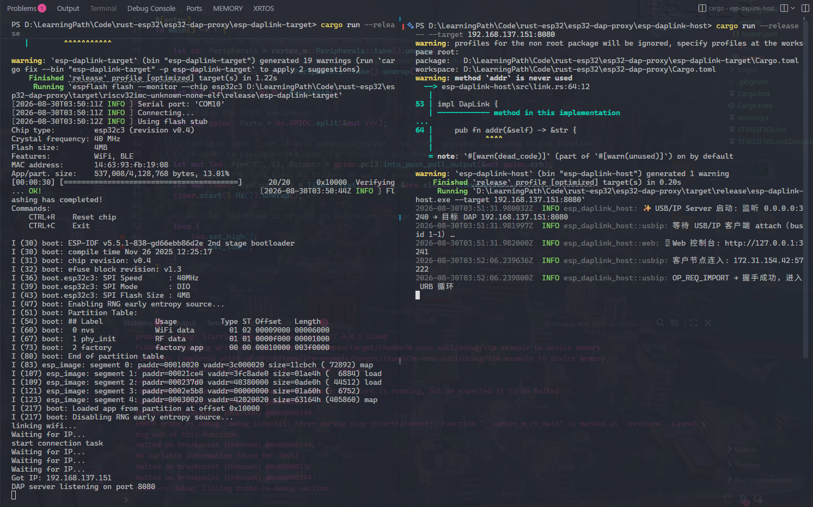
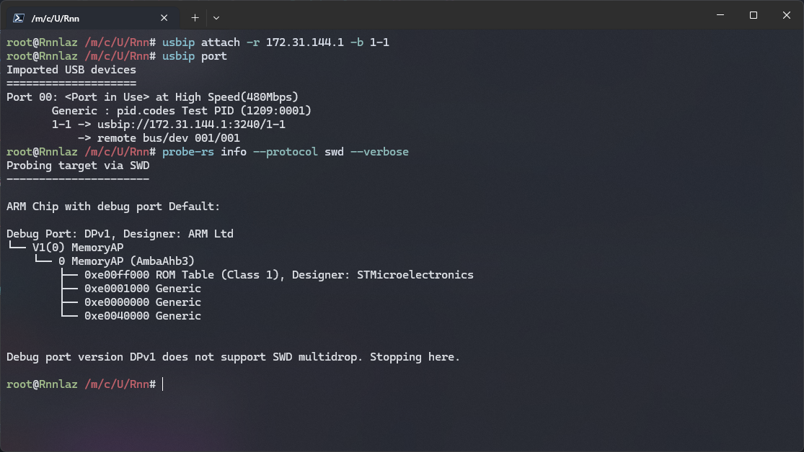

# esp32-dap-proxy

把 ESP32-C3 变成无线 CMSIS-DAP 调试探头：固件通过 WiFi 与 PC 通信，
PC 端以 USB/IP 协议将其模拟为真实的 USB 探头，可使用 probe-rs 对 Cortex-M 目标进行烧录与调试。

```text
probe-rs
  │  USB/IP（WSL: vhci-hcd）
  ▼
esp-daplink-host（PC 端）
  │  （WiFi TCP）
  ▼
esp-daplink-target（ESP32-C3 固件）
  │  GPIO 位带 SWD
  ▼
被调试的 Cortex-M 芯片
```

## 环境

- 硬件：ESP32-C3、Cortex-M 目标板；接线 `GPIO0 → SWCLK`、`GPIO1 → SWDIO`、共地
- WSL：`usbip` 客户端、probe-rs
- 固件：esp-rs 工具链（rustup target add riscv32imc-unknown-none-elf）、cargo install espflash

## 使用

### 1. 固件

复制 `.env.example` 为 `.env`，填入 WiFi 的 `SSID` 与 `PASSWORD`：

```
SSID=Your_WiFi_Name
PASSWORD=Your_WiFi_Password
```

```bash
cargo run --release
```

串口输出 `Got IP: x.x.x.x` 即上线，记下该地址。

### 2. Host

将默认目标地址改为实际 ESP32 地址后运行：

```bash
cargo run --release -- --target x.x.x.x:8080
```

可用 `--listen` / `--web` 调整 USB/IP 与控制台监听地址，`RUST_LOG=debug` 打开详细日志。

成功连接：


### 3. WSL 挂载虚拟 USB 设备

**以下步骤在 WSL 终端中执行**

<HOST_IP> 为主机IP地址，确保 Windows 防火墙放行 3240 端口入站。

```bash
modprobe vhci-hcd
usbip list -r <HOST_IP>
```

```
Imported USB devices
====================
Port 00: <Port in Use> at High Speed(480Mbps)
       Generic : pid.codes Test PID (1209:0001)
       1-1 -> usbip://172.31.144.1:3240/1-1
           -> remote bus/dev 001/001
```

```bash
usbip attach -r <HOST_IP> -b 1-1
```

查看已挂载的设备:

```bash
usbip port
```



### 4. 调试

```bash
probe-rs list
probe-rs info --protocol swd --verbose
```

VS Code 安装 probe-rs-debugger 扩展后可直接断点调试。
注意运行调试后需手动 Reset 目标芯片。
通信不稳定时，可以降低 `src/probe/io/bitbang.rs` 中的 `DEFAULT_DELAY`，或 `SWDIO` 改用 `OpenDrain` + 外接上拉


断点：


Web 控制台：http://127.0.0.1:3241 。

## 未实现

- `ESP32` 在线扫描与模式配置
- `JTAG 协议` 未实现
- `SWD` / `DAP` 部分命令未实现
- `UART` / `BLE` 桥